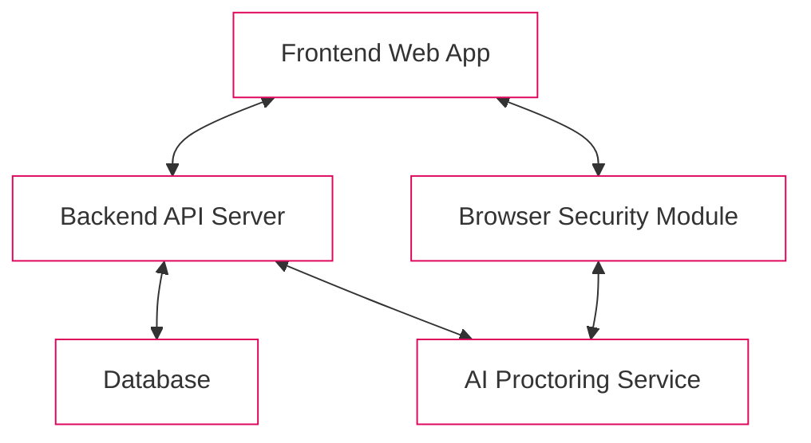

# AI-Powered Test Monitoring Platform Design Document {style="color: #df065d"}

> **Version:** 1.0  
> **Date:** September 8, 2025  
> **Author:** NK

## 1. Introduction

### 1.1. Purpose
This document outlines the design and architecture for an AI-Powered Test Monitoring Platform. The platform provides a secure and cheat-proof environment for conducting online examinations and assessments, leveraging artificial intelligence to monitor candidates in real-time.

### 1.2. Scope
The platform supports:
- User authentication (secure login and registration)
- Secure test-taking environment with countdown timer
- Browser lockdown features
- AI-driven proctoring via webcam and microphone
- Administrative dashboard for results and proctoring flags
- Optional third-camera setup for enhanced proctoring (configurable by interviewer)
- Voice recognition test for candidate verification
- Interview flow with different question types (conversational and coding)
- AI-powered question generation based on job descriptions
- Candidate management and test distribution

### 1.3. Target Audience
- **Test Administrators**: Educational institutions, corporate training departments, certification bodies
- **Test Takers**: Students and candidates participating in online assessments

## 2. System Architecture

---

### 2.1. High-Level Diagram



### 2.2. Components
1. **Frontend (Client-side)**
   - Single-page application (SPA)
   - Camera and microphone stream handling
   - Browser restrictions enforcement

2. **Backend (Server-side)**
   - Business logic APIs
   - User management
   - Test administration
   - AI service communication

3. **Database**
   - User data storage
   - Test content management
   - Results and proctoring logs

4. **AI Proctoring Service**
   - Audio/video stream processing
   - Machine learning models integration
   - Real-time malpractice detection

## 3. Core Features & Functionalities

### 3.1. User Authentication
- Secure registration with email verification
- JWT-based authentication
- Role-Based Access Control (RBAC)


### 3.2. Secure Test Environment
- Pre-test system checks
- Server-synchronized countdown timer
- Tab & browser restrictions:
  - Full-screen mode
  - Navigation prevention
  - Copy-paste restrictions

### 3.3. AI Proctoring Features
- **Video Monitoring**
  - Face detection
  - Multiple face detection
  - Gaze tracking
  - Object detection
  - Multi-camera support
  - Hand position detection

- **Audio Monitoring**
  - Voice detection
  - Suspicious sound detection
  - Speech recognition and verification
  - Voice activity analysis

- **Flagging System**
  - Real-time analysis
  - Severity categorization
  - Timestamped events
  - Multi-camera violation correlation

### 3.4. Test Administration & Reporting
- Test creation interface
- Candidate management
- Results dashboard
- Detailed proctoring reports

### 3.5. Pre-Interview Setup & Calibration
- **Third-Camera Setup (Optional)**
  - Camera position guide overlay
  - Real-time position validation
  - Face and hand detection for optimal positioning
  - Visual feedback system
  - Configurable by interviewer during test creation

- **Microphone & Voice Recognition Test**
  - Sample sentence reading and verification
  - Voice-to-text accuracy validation
  - Background noise assessment
  - Audio quality feedback

### 3.6. Interview Flow & Question Engine
- **Question Type Differentiation**
  - Conversational question handling
  - Coding question with integrated editor
  - Adaptive timing based on question type
  - Question sequencing and flow control

- **Answering Controls**
  - Audio recording for conversational questions
  - Code editor with syntax highlighting
  - Answer validation and submission
  - Progress tracking and navigation

### 3.7. Admin & Interviewer Flow
- **User & Credential Management**
  - Role-based user administration
  - Access control and permissions
  - Subscription-based feature access
  - Organization management

- **Test Creation & Distribution**
  - Manual question creation
  - AI-powered question generation
  - Proctoring configuration options (including third-camera toggle)
  - Candidate bulk import
  - Test assignment and link generation

## 4. Database Schema

### Users Table
```sql
CREATE TABLE Users (
    user_id UUID PRIMARY KEY,
    email VARCHAR(255) UNIQUE,
    password_hash TEXT,
    full_name VARCHAR(255),
    role VARCHAR(50),
    organization_id UUID REFERENCES Organizations(organization_id),
    created_at TIMESTAMP DEFAULT CURRENT_TIMESTAMP,
    updated_at TIMESTAMP DEFAULT CURRENT_TIMESTAMP
);
```

### Organizations Table
```sql
CREATE TABLE Organizations (
    organization_id UUID PRIMARY KEY,
    name VARCHAR(255),
    subscription_status VARCHAR(50), -- 'trial', 'active', 'expired'
    expiry_date TIMESTAMP,
    created_at TIMESTAMP DEFAULT CURRENT_TIMESTAMP,
    updated_at TIMESTAMP DEFAULT CURRENT_TIMESTAMP
);
```

### Tests Table
```sql
CREATE TABLE Tests (
    test_id UUID PRIMARY KEY,
    title VARCHAR(255),
    job_description TEXT,
    resume_url TEXT,
    duration_minutes INTEGER,
    requires_secondary_camera BOOLEAN DEFAULT FALSE,
    created_by UUID REFERENCES Users(user_id),
    created_at TIMESTAMP,
    updated_at TIMESTAMP
);
```

### Questions Table
```sql
CREATE TABLE Questions (
    question_id UUID PRIMARY KEY,
    test_id UUID REFERENCES Tests(test_id),
    question_type VARCHAR(50), -- 'conversational', 'coding'
    question_text TEXT,
    difficulty VARCHAR(50), -- 'Easy', 'Intermediate', 'Hard'
    time_to_start INTEGER, -- seconds to start answering, NULL for coding questions
    question_order INTEGER,
    created_at TIMESTAMP,
    updated_at TIMESTAMP
);
```

### Candidates Table
```sql
CREATE TABLE Candidates (
    candidate_id UUID PRIMARY KEY,
    name VARCHAR(255),
    email VARCHAR(255),
    resume_url TEXT,
    created_at TIMESTAMP,
    updated_at TIMESTAMP
);
```

### TestAssignments Table
```sql
CREATE TABLE TestAssignments (
    assignment_id UUID PRIMARY KEY,
    test_id UUID REFERENCES Tests(test_id),
    candidate_id UUID REFERENCES Candidates(candidate_id),
    unique_link VARCHAR(255) UNIQUE,
    status VARCHAR(50), -- 'pending', 'in_progress', 'completed'
    created_at TIMESTAMP,
    started_at TIMESTAMP,
    completed_at TIMESTAMP
);
```

### TestAttempts Table
```sql
CREATE TABLE TestAttempts (
    attempt_id UUID PRIMARY KEY,
    assignment_id UUID REFERENCES TestAssignments(assignment_id),
    start_time TIMESTAMP,
    end_time TIMESTAMP,
    status VARCHAR(50),  -- 'IN_PROGRESS', 'COMPLETED', 'TERMINATED'
    last_saved_at TIMESTAMP,
    notes TEXT,
    connection_drops INTEGER DEFAULT 0
);
```

### Answers Table
```sql
CREATE TABLE Answers (
    answer_id UUID PRIMARY KEY,
    question_id UUID REFERENCES Questions(question_id),
    assignment_id UUID REFERENCES TestAssignments(assignment_id),
    content TEXT,
    recording_url TEXT,
    code_submission TEXT,
    started_at TIMESTAMP,
    submitted_at TIMESTAMP
);
```

### ProctorSessions Table
```sql
CREATE TABLE ProctorSessions (
    session_id UUID PRIMARY KEY,
    assignment_id UUID REFERENCES TestAssignments(assignment_id),
    started_at TIMESTAMP,
    ended_at TIMESTAMP,
    primary_camera_active BOOLEAN DEFAULT TRUE,
    secondary_camera_active BOOLEAN DEFAULT FALSE,
    secondary_camera_required BOOLEAN DEFAULT FALSE,
    microphone_active BOOLEAN DEFAULT TRUE
);
```

### Violations Table
```sql
CREATE TABLE Violations (
    violation_id UUID PRIMARY KEY,
    session_id UUID REFERENCES ProctorSessions(session_id),
    type VARCHAR(50),  -- 'CRITICAL', 'MAJOR', 'MINOR'
    category VARCHAR(50), -- 'face_violation', 'gaze_violation', 'audio_violation', 'object_violation'
    description TEXT,
    timestamp TIMESTAMP,
    evidence_url TEXT,  -- S3/Cloud Storage URL for video/audio snippet
    camera_source VARCHAR(50), -- 'primary', 'secondary'
    status VARCHAR(50)  -- 'PENDING_REVIEW', 'CONFIRMED', 'DISMISSED'
);
```

## 5. Technology Stack

### Frontend
- Next.js (React)
- WebRTC
- Socket.IO
- Tailwind CSS
- Zustand

### Backend
- Node.js with NestJS
- Prisma ORM
- JWT & Passport.js
- PostgreSQL

### AI Service
- Python with FastAPI
- OpenCV
- TensorFlow/PyTorch
- Web Speech API integration
- Multi-camera stream processing
- LLM integration for question generation

### Deployment
- Docker
- Kubernetes
- AWS/GCP/Azure

#### Cloud Provider Deployment

##### AWS Configuration
```yaml
# EKS Cluster Configuration
apiVersion: eksctl.io/v1alpha5
kind: ClusterConfig
metadata:
  name: test-monitor-cluster
  region: us-west-2
nodeGroups:
  - name: standard-workers
    instanceType: t3.large
    desiredCapacity: 3
    minSize: 2
    maxSize: 5
  - name: gpu-workers
    instanceType: g4dn.xlarge
    desiredCapacity: 2
    minSize: 1
    maxSize: 3
    volumeSize: 100
    labels:
      role: gpu-worker

# Additional AWS Services
services:
  - RDS PostgreSQL (db.t3.large)
  - ElastiCache Redis (cache.t3.medium)
  - S3 Buckets for media storage
  - CloudFront for content delivery
  - Route53 for DNS management
  - ACM for SSL certificates
```

##### GCP Configuration
```yaml
# GKE Cluster Configuration
apiVersion: container.googleapis.com/v1beta1
kind: Cluster
metadata:
  name: test-monitor-cluster
  location: us-central1
spec:
  nodePools:
  - name: standard-pool
    config:
      machineType: n2-standard-4
      diskSizeGb: 100
    initialNodeCount: 3
    autoscaling:
      minNodeCount: 2
      maxNodeCount: 5
  - name: gpu-pool
    config:
      machineType: n1-standard-4
      accelerators:
      - acceleratorCount: 1
        acceleratorType: nvidia-tesla-t4
    initialNodeCount: 2

# Additional GCP Services
services:
  - Cloud SQL (PostgreSQL)
  - Memorystore (Redis)
  - Cloud Storage
  - Cloud CDN
  - Cloud DNS
  - Cloud Load Balancing
```

##### Azure Configuration
```yaml
# AKS Cluster Configuration
apiVersion: azure.microsoft.com/v1
kind: ManagedCluster
metadata:
  name: test-monitor-cluster
  location: eastus
properties:
  dnsPrefix: test-monitor
  agentPoolProfiles:
  - name: standardpool
    vmSize: Standard_DS3_v2
    count: 3
    minCount: 2
    maxCount: 5
    enableAutoScaling: true
  - name: gpupool
    vmSize: Standard_NC6s_v3
    count: 2
    minCount: 1
    maxCount: 3

# Additional Azure Services
services:
  - Azure Database for PostgreSQL
  - Azure Cache for Redis
  - Azure Blob Storage
  - Azure CDN
  - Azure DNS
  - Azure Front Door
```

#### Infrastructure Requirements

##### Compute Resources
- Standard Nodes:
  - CPU: 4-8 cores
  - RAM: 16-32GB
  - Storage: 100GB SSD
- GPU Nodes:
  - GPU: NVIDIA T4/P4
  - CPU: 8-16 cores
  - RAM: 32-64GB
  - Storage: 200GB SSD

##### Network Requirements
- Bandwidth: 100Mbps minimum
- Latency: <50ms for optimal proctoring
- SSL/TLS termination
- DDoS protection
- WAF (Web Application Firewall)

##### Scaling Parameters
- CPU Utilization: 70% threshold
- Memory Utilization: 80% threshold
- Concurrent Users: 500-1000 per node
- Auto-scaling response time: <2 minutes

## 6. Security & Privacy Considerations

### Data Protection
- End-to-end encryption
- Secure media streams (SRTP)
- Data privacy compliance
- Access control mechanisms

### User Consent
- Explicit permission requirements
- Clear privacy policy
- Data retention policies
- Administrator access restrictions

## 7. Monitoring and Alerting

### Alert Manager Configuration
```yaml
apiVersion: monitoring.coreos.com/v1
kind: AlertmanagerConfig
metadata:
  name: test-monitor-alerts
spec:
  route:
    receiver: 'team-alerts'
    group_by: ['alertname', 'cluster', 'service']
    group_wait: 30s
    group_interval: 5m
    repeat_interval: 4h
    routes:
    - match:
        severity: critical
      receiver: 'critical-alerts'
      repeat_interval: 1h
    - match:
        severity: warning
      receiver: 'team-alerts'
  receivers:
  - name: 'team-alerts'
    slackConfigs:
    - channel: '#test-monitoring'
      apiURL: 'https://hooks.slack.com/services/xxx/yyy/zzz'
      title: '{{ template "slack.default.title" . }}'
      text: '{{ template "slack.default.text" . }}'
  - name: 'critical-alerts'
    emailConfigs:
    - to: 'oncall@yourdomain.com'
      from: 'alertmanager@yourdomain.com'
      smarthost: 'smtp.gmail.com:587'
    pagerdutyConfigs:
    - serviceKey: '<pagerduty-key>'
      description: '{{ template "pagerduty.default.description" . }}'
```

### Prometheus Rules
```yaml
apiVersion: monitoring.coreos.com/v1
kind: PrometheusRule
metadata:
  name: test-monitor-rules
spec:
  groups:
  - name: system.rules
    rules:
    - alert: HighCPUUsage
      expr: avg(rate(node_cpu_seconds_total{mode="idle"}[5m])) > 0.8
      for: 5m
      labels:
        severity: warning
      annotations:
        summary: High CPU usage detected
        description: CPU usage is above 80% for 5 minutes

    - alert: MemoryExhaustion
      expr: node_memory_MemAvailable_bytes / node_memory_MemTotal_bytes * 100 < 10
      for: 5m
      labels:
        severity: critical
      annotations:
        summary: Low memory available
        description: Node memory is below 10%

  - name: application.rules
    rules:
    - alert: HighLatency
      expr: histogram_quantile(0.95, rate(http_request_duration_seconds_bucket[5m])) > 2
      for: 5m
      labels:
        severity: warning
      annotations:
        summary: High API latency
        description: 95th percentile latency is above 2 seconds

    - alert: ErrorRate
      expr: rate(http_requests_total{status=~"5.."}[5m]) / rate(http_requests_total[5m]) * 100 > 5
      for: 5m
      labels:
        severity: critical
      annotations:
        summary: High error rate
        description: Error rate is above 5%

  - name: ai.rules
    rules:
    - alert: ModelLatency
      expr: histogram_quantile(0.95, rate(model_inference_duration_seconds_bucket[5m])) > 1
      for: 5m
      labels:
        severity: warning
      annotations:
        summary: Slow model inference
        description: AI model inference is taking longer than 1 second

    - alert: HighFalsePositives
      expr: rate(violation_detections_total{type="false_positive"}[1h]) / rate(violation_detections_total[1h]) * 100 > 10
      for: 15m
      labels:
        severity: warning
      annotations:
        summary: High false positive rate
        description: False positive rate is above 10%

  - name: security.rules
    rules:
    - alert: FailedLogins
      expr: rate(login_failures_total[5m]) > 10
      for: 5m
      labels:
        severity: critical
      annotations:
        summary: Multiple failed login attempts
        description: More than 10 failed logins in 5 minutes

    - alert: UnauthorizedAccess
      expr: rate(unauthorized_access_attempts_total[5m]) > 5
      for: 5m
      labels:
        severity: critical
      annotations:
        summary: Unauthorized access attempts
        description: Multiple unauthorized access attempts detected

## 10. Infrastructure Security Guidelines

### Network Security

#### Network Policies
```yaml
apiVersion: networking.k8s.io/v1
kind: NetworkPolicy
metadata:
  name: test-monitor-network-policy
spec:
  podSelector:
    matchLabels:
      app: test-monitor
  policyTypes:
  - Ingress
  - Egress
  ingress:
  - from:
    - namespaceSelector:
        matchLabels:
          name: ingress-nginx
    ports:
    - protocol: TCP
      port: 80
    - protocol: TCP
      port: 443
  egress:
  - to:
    - namespaceSelector:
        matchLabels:
          name: monitoring
    ports:
    - protocol: TCP
      port: 9090
```

#### SSL/TLS Configuration
```nginx
# NGINX SSL Configuration
ssl_protocols TLSv1.3;
ssl_prefer_server_ciphers on;
ssl_ciphers EECDH+AESGCM:EDH+AESGCM;
ssl_ecdh_curve secp384r1;
ssl_session_timeout 10m;
ssl_session_cache shared:SSL:10m;
ssl_session_tickets off;
ssl_stapling on;
ssl_stapling_verify on;
resolver 8.8.8.8 8.8.4.4 valid=300s;
resolver_timeout 5s;
add_header Strict-Transport-Security "max-age=63072000; includeSubDomains; preload";
add_header X-Frame-Options DENY;
add_header X-Content-Type-Options nosniff;
add_header X-XSS-Protection "1; mode=block";
```

### Container Security

#### Pod Security Policy
```yaml
apiVersion: policy/v1beta1
kind: PodSecurityPolicy
metadata:
  name: test-monitor-psp
spec:
  privileged: false
  allowPrivilegeEscalation: false
  requiredDropCapabilities:
    - ALL
  volumes:
    - 'configMap'
    - 'emptyDir'
    - 'projected'
    - 'secret'
    - 'downwardAPI'
    - 'persistentVolumeClaim'
  hostNetwork: false
  hostIPC: false
  hostPID: false
  runAsUser:
    rule: 'MustRunAsNonRoot'
  seLinux:
    rule: 'RunAsAny'
  supplementalGroups:
    rule: 'MustRunAs'
    ranges:
      - min: 1
        max: 65535
  fsGroup:
    rule: 'MustRunAs'
    ranges:
      - min: 1
        max: 65535
  readOnlyRootFilesystem: true
```

### Access Control

#### RBAC Configuration
```yaml
apiVersion: rbac.authorization.k8s.io/v1
kind: Role
metadata:
  namespace: test-monitor
  name: pod-reader
rules:
- apiGroups: [""]
  resources: ["pods", "pods/log"]
  verbs: ["get", "list"]
- apiGroups: [""]
  resources: ["configmaps"]
  verbs: ["get"]
---
apiVersion: rbac.authorization.k8s.io/v1
kind: RoleBinding
metadata:
  name: read-pods
  namespace: test-monitor
subjects:
- kind: ServiceAccount
  name: monitoring-sa
  namespace: test-monitor
roleRef:
  kind: Role
  name: pod-reader
  apiGroup: rbac.authorization.k8s.io
```

### Secrets Management

#### Vault Configuration
```hcl
# Vault Policy
path "secret/test-monitor/*" {
  capabilities = ["read", "list"]
}

path "secret/test-monitor/db-creds" {
  capabilities = ["read"]
  allowed_parameters = {
    "username" = []
    "password" = []
  }
}

# Kubernetes Authentication
path "auth/kubernetes/*" {
  capabilities = ["create", "read", "update", "delete", "list"]
}
```

### Security Hardening

#### System Hardening Checklist
1. Host Security
   ```bash
   # Disable unused services
   systemctl disable bluetooth.service
   systemctl disable cups.service
   
   # Set file permissions
   chmod 600 /etc/ssh/sshd_config
   chmod 600 /etc/shadow
   
   # Configure firewall
   ufw default deny incoming
   ufw default allow outgoing
   ufw allow ssh
   ufw allow http
   ufw allow https
   ufw enable
   ```

2. Docker Security
   ```dockerfile
   # Secure Dockerfile
   FROM alpine:3.14
   
   # Add non-root user
   RUN addgroup -S appgroup && adduser -S appuser -G appgroup
   
   # Set working directory
   WORKDIR /app
   
   # Copy application files
   COPY --chown=appuser:appgroup . .
   
   # Use non-root user
   USER appuser
   
   # Use specific versions
   RUN apk add --no-cache nodejs=14.17.0-r0
   ```

3. Kubernetes Security
   ```yaml
   # Security Context
   securityContext:
     runAsNonRoot: true
     runAsUser: 1000
     readOnlyRootFilesystem: true
     allowPrivilegeEscalation: false
     capabilities:
       drop:
         - ALL
   ```

### Compliance Requirements

#### Data Protection
1. Encryption at Rest
   - Database encryption using AES-256
   - File storage encryption with customer-managed keys
   - Secure key management with AWS KMS/Azure Key Vault

2. Encryption in Transit
   - TLS 1.3 for all API communications
   - mTLS for service-to-service communication
   - SRTP for media streams

3. Data Classification
   - Personal Identifiable Information (PII)
   - Test Content (Confidential)
   - Analytics Data (Internal)

#### Audit Requirements
1. System Logs
   - Authentication attempts
   - Administrative actions
   - Data access patterns
   - Security events

2. Compliance Reports
   - Monthly security assessments
   - Quarterly penetration testing
   - Annual compliance audits

3. Retention Policies
   - System logs: 90 days
   - Security events: 1 year
   - Compliance reports: 7 years

### Incident Response

#### Response Procedures
```yaml
severity_levels:
  critical:
    response_time: "15 minutes"
    notification: ["security_team", "devops_team", "management"]
    actions:
      - Isolate affected systems
      - Initiate incident response plan
      - Notify affected users
  
  high:
    response_time: "1 hour"
    notification: ["security_team", "devops_team"]
    actions:
      - Investigate root cause
      - Apply mitigation measures
      - Prepare incident report

  medium:
    response_time: "4 hours"
    notification: ["devops_team"]
    actions:
      - Monitor system behavior
      - Update security patches
      - Document findings

  low:
    response_time: "24 hours"
    notification: ["system_admin"]
    actions:
      - Schedule maintenance
      - Update documentation
      - Review security controls
